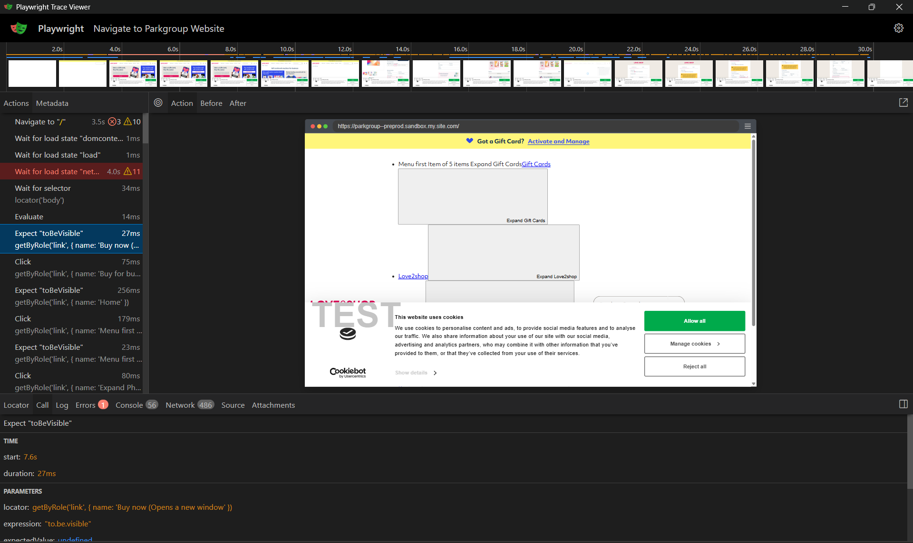

# Playwright-Traces

## What are Playwright-traces?

In short, they are a zip file of images and test steps, sometimes including the Playwright code of a test for that step.

> For each test, there will be a unique zip file with the title of the test.

To run a specific trace file, open powershell and enter :-

```powershell
npx playwright show-trace "C:\Dev\L2S.Playwright.Poc\playwright-traces\<trace-file>.zip"
```

Changing the `<trace-file>.zip` with the name of the test zip file you wish to open.


