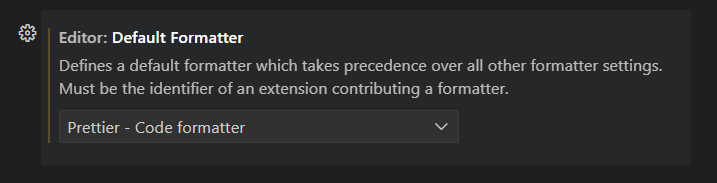
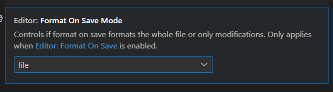

# Recommended settings for Prettier Extension

1. Navigate to `File → Preferences → Settings → Text Editor`.
2. Search for Default Formatter and ensure Prettier is chosen.
   
3. If you scroll a bit further you should see format on save.
   1. Ensure "file" is selected.
      
